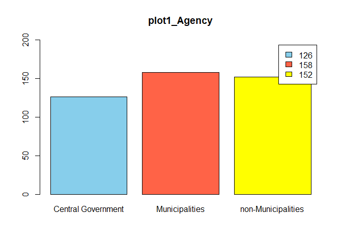
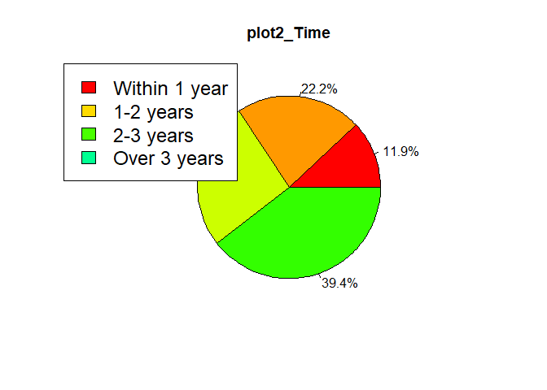
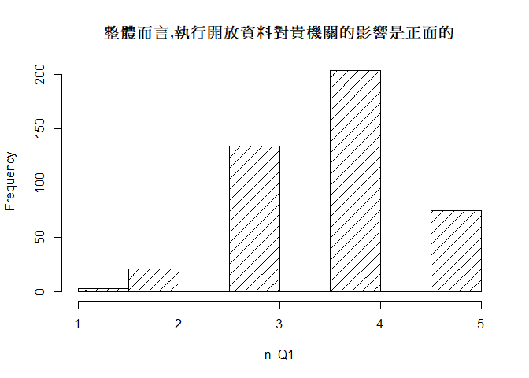
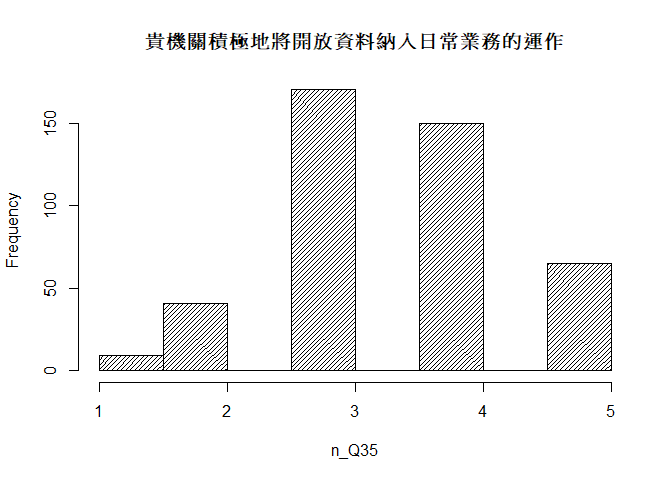

多變量課程作業1
================
Yang

# 1資料整理 (先用SPSS整理資料，再用R讀入資料)

## 用R讀取SPSS資料

``` r
library(haven)
library(magrittr)
library(ggplot2)

hw1 <- read_spss("~/R_多變量課程/data/HW1.sav")
```

``` r
##1-1快速檢視資料
options(scipen = 999)     #科學符號改以數字呈現
str(hw1)
```

    ## tibble [436 x 41] (S3: tbl_df/tbl/data.frame)
    ##  $ ID    : num [1:436] 1 2 3 4 5 6 7 8 9 10 ...
    ##   ..- attr(*, "format.spss")= chr "F11.0"
    ##   ..- attr(*, "display_width")= int 11
    ##  $ Agency: dbl+lbl [1:436] 3, 3, 3, 2, 3, 3, 2, 2, 2, 2, 2, 1, 3, 3, 1, 2, 2, 2, ...
    ##    ..@ format.spss  : chr "F23.0"
    ##    ..@ display_width: int 14
    ##    ..@ labels       : Named num [1:3] 1 2 3
    ##    .. ..- attr(*, "names")= chr [1:3] "中央機關" "地方機關(六都)" "地方機關(非六都)"
    ##  $ time  : dbl+lbl [1:436] 1, 4, 4, 4, 2, 1, 4, 4, 4, 3, 4, 4, 1, 1, 4, 3, 4, 2, ...
    ##    ..@ format.spss  : chr "F15.0"
    ##    ..@ display_width: int 15
    ##    ..@ labels       : Named num [1:4] 1 2 3 4
    ##    .. ..- attr(*, "names")= chr [1:4] "1年以內" "1年~2年以內" "2年~3年以內" "3年以上"
    ##  $ Q1    : dbl+lbl [1:436] 4, 4, 3, 5, 1, 3, 3, 3, 4, 4, 4, 5, 3, 3, 4, 2, 3, 3, ...
    ##    ..@ format.spss  : chr "F11.0"
    ##    ..@ display_width: int 11
    ##    ..@ labels       : Named num [1:5] 1 2 3 4 5
    ##    .. ..- attr(*, "names")= chr [1:5] "非常不符合" "不符合" "普通" "符合" ...
    ##  $ Q2    : dbl+lbl [1:436]  4,  4,  3,  5,  1,  3,  3,  3,  3,  4,  4,  5, NA,  3...
    ##    ..@ format.spss  : chr "F11.0"
    ##    ..@ display_width: int 11
    ##    ..@ labels       : Named num [1:5] 1 2 3 4 5
    ##    .. ..- attr(*, "names")= chr [1:5] "非常不符合" "不符合" "普通" "符合" ...
    ##  $ Q3    : dbl+lbl [1:436] 4, 4, 3, 5, 1, 3, 3, 3, 4, 4, 4, 5, 3, 3, 4, 3, 3, 3, ...
    ##    ..@ format.spss  : chr "F11.0"
    ##    ..@ display_width: int 11
    ##    ..@ labels       : Named num [1:5] 1 2 3 4 5
    ##    .. ..- attr(*, "names")= chr [1:5] "非常不符合" "不符合" "普通" "符合" ...
    ##  $ Q4    : dbl+lbl [1:436] 4, 4, 3, 5, 1, 3, 3, 3, 3, 4, 4, 5, 3, 3, 3, 3, 3, 3, ...
    ##    ..@ format.spss  : chr "F11.0"
    ##    ..@ display_width: int 11
    ##    ..@ labels       : Named num [1:5] 1 2 3 4 5
    ##    .. ..- attr(*, "names")= chr [1:5] "非常不符合" "不符合" "普通" "符合" ...
    ##  $ Q5    : dbl+lbl [1:436]  3,  4,  4,  5,  5,  3,  5,  3,  3,  3,  4,  3,  3,  3...
    ##    ..@ format.spss  : chr "F11.0"
    ##    ..@ display_width: int 11
    ##    ..@ labels       : Named num [1:5] 1 2 3 4 5
    ##    .. ..- attr(*, "names")= chr [1:5] "非常不符合" "不符合" "普通" "符合" ...
    ##  $ Q6    : dbl+lbl [1:436] 3, 4, 5, 3, 5, 3, 5, 5, 2, 4, 4, 5, 3, 3, 4, 5, 5, 3, ...
    ##    ..@ format.spss  : chr "F11.0"
    ##    ..@ display_width: int 11
    ##    ..@ labels       : Named num [1:5] 1 2 3 4 5
    ##    .. ..- attr(*, "names")= chr [1:5] "非常不符合" "不符合" "普通" "符合" ...
    ##  $ Q7    : dbl+lbl [1:436] 3, 4, 3, 3, 5, 3, 5, 4, 2, 3, 3, 1, 3, 3, 3, 4, 3, 3, ...
    ##    ..@ format.spss  : chr "F11.0"
    ##    ..@ display_width: int 11
    ##    ..@ labels       : Named num [1:5] 1 2 3 4 5
    ##    .. ..- attr(*, "names")= chr [1:5] "非常不符合" "不符合" "普通" "符合" ...
    ##  $ Q8    : dbl+lbl [1:436]  3,  4,  3,  5,  3,  3,  5,  4,  4,  4,  4,  5,  3,  4...
    ##    ..@ format.spss  : chr "F11.0"
    ##    ..@ display_width: int 11
    ##    ..@ labels       : Named num [1:5] 1 2 3 4 5
    ##    .. ..- attr(*, "names")= chr [1:5] "非常不符合" "不符合" "普通" "符合" ...
    ##  $ Q9    : dbl+lbl [1:436] 3, 4, 4, 5, 3, 3, 5, 5, 4, 4, 4, 5, 4, 4, 4, 4, 5, 3, ...
    ##    ..@ format.spss  : chr "F11.0"
    ##    ..@ display_width: int 11
    ##    ..@ labels       : Named num [1:5] 1 2 3 4 5
    ##    .. ..- attr(*, "names")= chr [1:5] "非常不符合" "不符合" "普通" "符合" ...
    ##  $ Q10   : dbl+lbl [1:436] 3, 5, 4, 5, 3, 3, 3, 4, 4, 4, 4, 5, 3, 3, 4, 3, 3, 2, ...
    ##    ..@ format.spss  : chr "F11.0"
    ##    ..@ display_width: int 11
    ##    ..@ labels       : Named num [1:5] 1 2 3 4 5
    ##    .. ..- attr(*, "names")= chr [1:5] "非常不符合" "不符合" "普通" "符合" ...
    ##  $ Q11   : dbl+lbl [1:436] 3, 5, 4, 5, 1, 3, 3, 3, 3, 4, 5, 5, 3, 3, 4, 3, 3, 2, ...
    ##    ..@ format.spss  : chr "F11.0"
    ##    ..@ display_width: int 11
    ##    ..@ labels       : Named num [1:5] 1 2 3 4 5
    ##    .. ..- attr(*, "names")= chr [1:5] "非常不符合" "不符合" "普通" "符合" ...
    ##  $ Q12   : dbl+lbl [1:436] 3, 5, 4, 5, 1, 3, 3, 5, 4, 4, 5, 5, 3, 4, 4, 3, 3, 2, ...
    ##    ..@ format.spss  : chr "F11.0"
    ##    ..@ display_width: int 11
    ##    ..@ labels       : Named num [1:5] 1 2 3 4 5
    ##    .. ..- attr(*, "names")= chr [1:5] "非常不符合" "不符合" "普通" "符合" ...
    ##  $ Q13   : dbl+lbl [1:436] 3, 5, 3, 5, 1, 4, 3, 5, 4, 4, 5, 5, 3, 4, 3, 3, 1, 2, ...
    ##    ..@ format.spss  : chr "F11.0"
    ##    ..@ display_width: int 11
    ##    ..@ labels       : Named num [1:5] 1 2 3 4 5
    ##    .. ..- attr(*, "names")= chr [1:5] "非常不符合" "不符合" "普通" "符合" ...
    ##  $ Q14   : dbl+lbl [1:436] 3, 4, 4, 5, 1, 3, 3, 4, 3, 4, 3, 5, 2, 3, 4, 3, 5, 3, ...
    ##    ..@ format.spss  : chr "F11.0"
    ##    ..@ display_width: int 11
    ##    ..@ labels       : Named num [1:5] 1 2 3 4 5
    ##    .. ..- attr(*, "names")= chr [1:5] "非常不符合" "不符合" "普通" "符合" ...
    ##  $ Q15   : dbl+lbl [1:436] 3, 4, 5, 5, 1, 2, 3, 4, 2, 4, 3, 5, 2, 3, 4, 3, 3, 3, ...
    ##    ..@ format.spss  : chr "F11.0"
    ##    ..@ display_width: int 11
    ##    ..@ labels       : Named num [1:5] 1 2 3 4 5
    ##    .. ..- attr(*, "names")= chr [1:5] "非常不符合" "不符合" "普通" "符合" ...
    ##  $ Q16   : dbl+lbl [1:436] 3, 4, 5, 5, 1, 3, 3, 4, 3, 4, 3, 5, 2, 3, 4, 3, 3, 3, ...
    ##    ..@ format.spss  : chr "F11.0"
    ##    ..@ display_width: int 11
    ##    ..@ labels       : Named num [1:5] 1 2 3 4 5
    ##    .. ..- attr(*, "names")= chr [1:5] "非常不符合" "不符合" "普通" "符合" ...
    ##  $ Q17   : dbl+lbl [1:436] 4, 4, 4, 5, 1, 3, 3, 5, 4, 4, 4, 5, 3, 3, 3, 3, 5, 4, ...
    ##    ..@ format.spss  : chr "F11.0"
    ##    ..@ display_width: int 11
    ##    ..@ labels       : Named num [1:5] 1 2 3 4 5
    ##    .. ..- attr(*, "names")= chr [1:5] "非常不符合" "不符合" "普通" "符合" ...
    ##  $ Q18   : dbl+lbl [1:436] 4, 4, 3, 5, 1, 3, 3, 5, 4, 4, 4, 5, 3, 3, 3, 3, 5, 4, ...
    ##    ..@ format.spss  : chr "F11.0"
    ##    ..@ display_width: int 11
    ##    ..@ labels       : Named num [1:5] 1 2 3 4 5
    ##    .. ..- attr(*, "names")= chr [1:5] "非常不符合" "不符合" "普通" "符合" ...
    ##  $ Q19   : dbl+lbl [1:436] 4, 5, 4, 5, 1, 3, 3, 5, 4, 5, 4, 5, 3, 3, 3, 3, 5, 4, ...
    ##    ..@ format.spss  : chr "F11.0"
    ##    ..@ display_width: int 11
    ##    ..@ labels       : Named num [1:5] 1 2 3 4 5
    ##    .. ..- attr(*, "names")= chr [1:5] "非常不符合" "不符合" "普通" "符合" ...
    ##  $ Q20   : dbl+lbl [1:436] 4, 4, 5, 5, 3, 3, 3, 5, 3, 4, 5, 5, 4, 3, 5, 4, 5, 2, ...
    ##    ..@ format.spss  : chr "F11.0"
    ##    ..@ display_width: int 11
    ##    ..@ labels       : Named num [1:5] 1 2 3 4 5
    ##    .. ..- attr(*, "names")= chr [1:5] "非常不符合" "不符合" "普通" "符合" ...
    ##  $ Q21   : dbl+lbl [1:436] 4, 3, 5, 5, 3, 3, 3, 5, 3, 4, 5, 5, 4, 3, 5, 4, 5, 2, ...
    ##    ..@ format.spss  : chr "F11.0"
    ##    ..@ display_width: int 11
    ##    ..@ labels       : Named num [1:5] 1 2 3 4 5
    ##    .. ..- attr(*, "names")= chr [1:5] "非常不符合" "不符合" "普通" "符合" ...
    ##  $ Q22   : dbl+lbl [1:436] 4, 4, 5, 5, 3, 3, 3, 5, 4, 4, 5, 5, 4, 3, 5, 4, 5, 2, ...
    ##    ..@ format.spss  : chr "F11.0"
    ##    ..@ display_width: int 11
    ##    ..@ labels       : Named num [1:5] 1 2 3 4 5
    ##    .. ..- attr(*, "names")= chr [1:5] "非常不符合" "不符合" "普通" "符合" ...
    ##  $ Q23   : dbl+lbl [1:436] 3, 2, 4, 5, 5, 3, 3, 4, 3, 4, 5, 5, 3, 3, 4, 4, 3, 3, ...
    ##    ..@ format.spss  : chr "F11.0"
    ##    ..@ display_width: int 11
    ##    ..@ labels       : Named num [1:5] 1 2 3 4 5
    ##    .. ..- attr(*, "names")= chr [1:5] "非常不符合" "不符合" "普通" "符合" ...
    ##  $ Q24   : dbl+lbl [1:436] 3, 3, 4, 5, 5, 4, 3, 4, 3, 4, 5, 5, 3, 3, 4, 4, 3, 3, ...
    ##    ..@ format.spss  : chr "F11.0"
    ##    ..@ display_width: int 11
    ##    ..@ labels       : Named num [1:5] 1 2 3 4 5
    ##    .. ..- attr(*, "names")= chr [1:5] "非常不符合" "不符合" "普通" "符合" ...
    ##  $ Q25   : dbl+lbl [1:436] 3, 4, 3, 5, 5, 3, 3, 4, 3, 4, 5, 5, 3, 3, 4, 4, 3, 3, ...
    ##    ..@ format.spss  : chr "F11.0"
    ##    ..@ display_width: int 11
    ##    ..@ labels       : Named num [1:5] 1 2 3 4 5
    ##    .. ..- attr(*, "names")= chr [1:5] "非常不符合" "不符合" "普通" "符合" ...
    ##  $ Q26   : dbl+lbl [1:436] 4, 3, 5, 4, 5, 3, 3, 2, 2, 3, 2, 1, 3, 3, 4, 3, 5, 4, ...
    ##    ..@ format.spss  : chr "F11.0"
    ##    ..@ display_width: int 11
    ##    ..@ labels       : Named num [1:5] 1 2 3 4 5
    ##    .. ..- attr(*, "names")= chr [1:5] "非常不符合" "不符合" "普通" "符合" ...
    ##  $ Q27   : dbl+lbl [1:436] 4, 4, 1, 1, 5, 3, 2, 1, 2, 2, 1, 1, 3, 3, 2, 3, 5, 3, ...
    ##    ..@ format.spss  : chr "F11.0"
    ##    ..@ display_width: int 11
    ##    ..@ labels       : Named num [1:5] 1 2 3 4 5
    ##    .. ..- attr(*, "names")= chr [1:5] "非常不符合" "不符合" "普通" "符合" ...
    ##  $ Q28   : dbl+lbl [1:436] 4, 4, 1, 5, 5, 3, 2, 1, 3, 2, 1, 1, 3, 3, 3, 3, 1, 3, ...
    ##    ..@ format.spss  : chr "F11.0"
    ##    ..@ display_width: int 11
    ##    ..@ labels       : Named num [1:5] 1 2 3 4 5
    ##    .. ..- attr(*, "names")= chr [1:5] "非常不符合" "不符合" "普通" "符合" ...
    ##  $ Q29   : dbl+lbl [1:436]  3,  3,  3,  5,  1,  4,  5,  4,  3,  4,  4,  5,  3,  3...
    ##    ..@ format.spss  : chr "F11.0"
    ##    ..@ display_width: int 11
    ##    ..@ labels       : Named num [1:5] 1 2 3 4 5
    ##    .. ..- attr(*, "names")= chr [1:5] "非常不符合" "不符合" "普通" "符合" ...
    ##  $ Q30   : dbl+lbl [1:436] 3, 3, 3, 5, 1, 4, 5, 4, 3, 4, 4, 5, 3, 3, 4, 3, 5, 3, ...
    ##    ..@ format.spss  : chr "F11.0"
    ##    ..@ display_width: int 11
    ##    ..@ labels       : Named num [1:5] 1 2 3 4 5
    ##    .. ..- attr(*, "names")= chr [1:5] "非常不符合" "不符合" "普通" "符合" ...
    ##  $ Q31   : dbl+lbl [1:436] 3, 3, 3, 5, 1, 3, 5, 4, 3, 4, 4, 5, 3, 3, 4, 3, 5, 3, ...
    ##    ..@ format.spss  : chr "F11.0"
    ##    ..@ display_width: int 11
    ##    ..@ labels       : Named num [1:5] 1 2 3 4 5
    ##    .. ..- attr(*, "names")= chr [1:5] "非常不符合" "不符合" "普通" "符合" ...
    ##  $ Q32   : dbl+lbl [1:436] 3, 3, 3, 5, 1, 4, 5, 4, 3, 4, 4, 5, 3, 3, 4, 3, 5, 3, ...
    ##    ..@ format.spss  : chr "F11.0"
    ##    ..@ display_width: int 11
    ##    ..@ labels       : Named num [1:5] 1 2 3 4 5
    ##    .. ..- attr(*, "names")= chr [1:5] "非常不符合" "不符合" "普通" "符合" ...
    ##  $ Q33   : dbl+lbl [1:436]  3,  3,  3,  5,  1,  3,  5,  5,  2,  4,  4,  5,  3,  3...
    ##    ..@ format.spss  : chr "F11.0"
    ##    ..@ display_width: int 11
    ##    ..@ labels       : Named num [1:5] 1 2 3 4 5
    ##    .. ..- attr(*, "names")= chr [1:5] "非常不符合" "不符合" "普通" "符合" ...
    ##  $ Q34   : dbl+lbl [1:436] 3, 3, 5, 5, 1, 3, 5, 4, 2, 4, 4, 5, 3, 3, 4, 4, 3, 2, ...
    ##    ..@ format.spss  : chr "F11.0"
    ##    ..@ display_width: int 11
    ##    ..@ labels       : Named num [1:5] 1 2 3 4 5
    ##    .. ..- attr(*, "names")= chr [1:5] "非常不符合" "不符合" "普通" "符合" ...
    ##  $ Q35   : dbl+lbl [1:436]  3,  3,  3,  5, NA,  3,  3,  4,  2,  4,  4,  5,  3,  3...
    ##    ..@ format.spss  : chr "F11.0"
    ##    ..@ display_width: int 11
    ##    ..@ labels       : Named num [1:5] 1 2 3 4 5
    ##    .. ..- attr(*, "names")= chr [1:5] "非常不符合" "不符合" "普通" "符合" ...
    ##  $ INT   : num [1:436] 3 3 3 5 1 3.75 5 4 3 4 ...
    ##   ..- attr(*, "format.spss")= chr "F8.2"
    ##   ..- attr(*, "display_width")= int 10
    ##  $ 機關  : dbl+lbl [1:436] 2, 2, 2, 2, 2, 2, 2, 2, 2, 2, 2, 1, 2, 2, 1, 2, 2, 2, ...
    ##    ..@ label        : chr "agency"
    ##    ..@ format.spss  : chr "F8.0"
    ##    ..@ display_width: int 10
    ##    ..@ labels       : Named num [1:2] 1 2
    ##    .. ..- attr(*, "names")= chr [1:2] "中央機關" "地方機關"
    ##  $ PU    : num [1:436] 4 4 3 5 1 3 3 3 3.5 4 ...
    ##   ..- attr(*, "format.spss")= chr "F8.2"
    ##   ..- attr(*, "display_width")= int 10

``` r
names(hw1)
```

    ##  [1] "ID"     "Agency" "time"   "Q1"     "Q2"     "Q3"     "Q4"     "Q5"    
    ##  [9] "Q6"     "Q7"     "Q8"     "Q9"     "Q10"    "Q11"    "Q12"    "Q13"   
    ## [17] "Q14"    "Q15"    "Q16"    "Q17"    "Q18"    "Q19"    "Q20"    "Q21"   
    ## [25] "Q22"    "Q23"    "Q24"    "Q25"    "Q26"    "Q27"    "Q28"    "Q29"   
    ## [33] "Q30"    "Q31"    "Q32"    "Q33"    "Q34"    "Q35"    "INT"    "機關"  
    ## [41] "PU"

``` r
dim(hw1)
```

    ## [1] 436  41

``` r
##1-2檢視會使用到的欄位
table(hw1$Agency)
```

    ## 
    ##   1   2   3 
    ## 126 158 152

``` r
table(hw1$Time)
```

    ## < table of extent 0 >

``` r
table(hw1$Q1)
```

    ## 
    ##   1   2   3   4   5 
    ##   3  21 134 203  75

``` r
table(hw1$Q2)
```

    ## 
    ##   1   2   3   4   5 
    ##   2  24 142 190  76

``` r
table(hw1$Q3)
```

    ## 
    ##   1   2   3   4   5 
    ##   3  18 134 202  78

``` r
table(hw1$Q4)
```

    ## 
    ##   1   2   3   4   5 
    ##   7  20 166 176  67

``` r
table(hw1$Q15)
```

    ## 
    ##   1   2   3   4   5 
    ##  14  61 159 161  41

``` r
table(hw1$Q29)
```

    ## 
    ##   1   2   3   4   5 
    ##   9  24 137 187  78

``` r
table(hw1$Q30)
```

    ## 
    ##   1   2   3   4   5 
    ##  11  36 151 170  68

``` r
table(hw1$Q31)
```

    ## 
    ##   1   2   3   4   5 
    ##   9  24 135 192  76

``` r
table(hw1$Q32)
```

    ## 
    ##   1   2   3   4   5 
    ##   7  24 126 194  84

``` r
table(hw1$Q35)
```

    ## 
    ##   1   2   3   4   5 
    ##   9  41 170 150  65

# 2敘述統計分析

``` r
##2-1_Nominal Variable：Agency(機關)
agency_level<-table(hw1$Agency)
names(agency_level)<-c("Central Government", "Municipalities", "non-Municipalities")
barplot(agency_level,ylim=c(0,200),main="plot1_Agency",legend=c(agency_level[1],agency_level[2],agency_level[3]),col=c("skyblue","tomato","yellow"))
```

<!-- -->

``` r
##2.2_Ordinal Variable：Time(已執行開放資料的歷程時間)
time_open <- table(hw1$time)
names(time_open) <- c("Within 1 year","1-2 years","2-3 years","Over 3 years")
##繪製百分比標籤並繪製圓餅圖
percentlabels <- round(100*time_open/sum(time_open),1)
pielabels <-paste(percentlabels,"%",sep="") ##將百分比用%合併並隔開四個標籤

pie(prop.table(time_open),main="plot2_Time",labels=pielabels,col=rainbow(10))
legend("topleft",names(time_open),cex=1.5,fill=rainbow(7))
```

<!-- -->

``` r
##2.3_Internal Variables：Q1(整體而言,執行開放資料對貴機關的影響是正面的)、Q35(貴機關積極地將開放資料納入日常業務的運作)
n_Q1 <- as.numeric(hw1$Q1)
n_Q35 <- as.numeric(hw1$Q35)
hist(n_Q1,main="整體而言,執行開放資料對貴機關的影響是正面的",nclass=7,density=10)
```

<!-- -->

``` r
hist(n_Q35,main="貴機關積極地將開放資料納入日常業務的運作",nclass=7,density=30)
```

<!-- -->

\#\#獨立樣本T檢定(大樣本)  
\#不同機關層級的具有足夠的專業以執行開放資料是否有顯著差異？ \#Agency: 機關 \#Q15: 貴機關本身具有足夠的專業以執行開放資料?

``` r
#3 t-test統計檢定
##Independent-sample t-test：Q15(貴機關本身具有足夠的專業以執行開放資料)、Agency(機關分為中央及地方，本文挑選中央及地方觀之)
str(hw1$"機關")
```

    ##  dbl+lbl [1:436] 2, 2, 2, 2, 2, 2, 2, 2, 2, 2, 2, 1, 2, 2, 1, 2, 2, 2, 2, 2...
    ##  @ label        : chr "agency"
    ##  @ format.spss  : chr "F8.0"
    ##  @ display_width: int 10
    ##  @ labels       : Named num [1:2] 1 2
    ##   ..- attr(*, "names")= chr [1:2] "中央機關" "地方機關"

``` r
class(hw1$"機關") # 必須是factor型態
```

    ## [1] "haven_labelled" "vctrs_vctr"     "double"

``` r
str(hw1$Q15) # 必須是numeric型態
```

    ##  dbl+lbl [1:436] 3, 4, 5, 5, 1, 2, 3, 4, 2, 4, 3, 5, 2, 3, 4, 3, 3, 3, 3, 4...
    ##  @ format.spss  : chr "F11.0"
    ##  @ display_width: int 11
    ##  @ labels       : Named num [1:5] 1 2 3 4 5
    ##   ..- attr(*, "names")= chr [1:5] "非常不符合" "不符合" "普通" "符合" ...

``` r
class(hw1$Q15)
```

    ## [1] "haven_labelled" "vctrs_vctr"     "double"

``` r
summary(hw1$Q15)
```

    ##    Min. 1st Qu.  Median    Mean 3rd Qu.    Max. 
    ##   1.000   3.000   3.000   3.353   4.000   5.000

``` r
#轉換格式：轉換為因子(factor)
hw1$"機關" <- factor(hw1$"機關", labels = c("中央機關", "地方機關"))
str(hw1$"機關")
```

    ##  Factor w/ 2 levels "中央機關","地方機關": 2 2 2 2 2 2 2 2 2 2 ...

``` r
class(hw1$"機關")
```

    ## [1] "factor"

``` r
#轉換格式：轉換為數值(numeric)
hw1$Q15<-as.numeric(hw1$Q15)
class(hw1$Q15)
```

    ## [1] "numeric"

``` r
# 分析步驟
# Step1：分析樣本平均數或建立交叉表
summary(hw1$"機關")
```

    ## 中央機關 地方機關 
    ##      126      310

``` r
summary(hw1$Q15)
```

    ##    Min. 1st Qu.  Median    Mean 3rd Qu.    Max. 
    ##   1.000   3.000   3.000   3.353   4.000   5.000

``` r
#先分組，再計算
#tapply(被分析的欄位(連續變數)，分組依據欄位(類別變數)，計算函數)
tapply(hw1$Q15, hw1$"機關", mean)
```

    ## 中央機關 地方機關 
    ## 3.587302 3.258065

``` r
# 從上述分析可以看到在Q15變項，中央機關的平均值(3.587302)大於地方機關(3.258065 )，可見中央機關本身有足夠專業性比地方更符合，但是否有顯著差異，端看t檢定。
# Step2：決定顯著水準( 0.1, 0.05, 0.01, 0.001)
# p<0.05
# Step3：寫出虛無假設與對立假設
# H0: 中央機關 = 地方機關； alpha=0.05；two.sided ##不同機關層級的具有足夠的專業以執行開放資料"沒有顯著差異"。
# H1: 中央機關 != 地方機關；alpha=0.05；two.sided
##不同機關層級的具有足夠的專業以執行開放資料"有顯著差異"。
# Step4：決定檢定方法
# 獨立樣本T檢定
# Step5：計算檢定值。
#首先要檢定兩組樣本變異數是否相等
#var.test(依變數~自變數)
var.test(hw1$Q15~hw1$"機關")# (p-value = 0.7252)<0.05，變異數相等。
```

    ## 
    ##  F test to compare two variances
    ## 
    ## data:  hw1$Q15 by hw1$機關
    ## F = 0.94537, num df = 125, denom df = 309, p-value = 0.7252
    ## alternative hypothesis: true ratio of variances is not equal to 1
    ## 95 percent confidence interval:
    ##  0.7105393 1.2815000
    ## sample estimates:
    ## ratio of variances 
    ##          0.9453723

``` r
#獨立樣本T檢定(變異數相等設定為var.equal = TRUE，反之為var.equal = FALSE)
#t.test(依變數~自變數, var.equal = FALSE)
## a.  #雙尾檢定
#a.H0: 中央 = 地方 ；H1: 中央 != 地方  alpha=0.05；two.sided #雙尾檢定
t.test(hw1$Q15~hw1$"機關",alternative = "two.sided", var.equal = TRUE)
```

    ## 
    ##  Two Sample t-test
    ## 
    ## data:  hw1$Q15 by hw1$機關
    ## t = 3.3396, df = 434, p-value = 0.0009115
    ## alternative hypothesis: true difference in means is not equal to 0
    ## 95 percent confidence interval:
    ##  0.1354707 0.5230035
    ## sample estimates:
    ## mean in group 中央機關 mean in group 地方機關 
    ##               3.587302               3.258065

``` r
#檢定值t = 3.3396, df = 434。
# Step6：計算p值
#p-value = 0.0009115
# Step7：
#因為(p-value = 0.0009115)<0.05，所以拒絕H0，H1成立：不同機關層級的具有足夠的專業以執行開放資料"有顯著差異"。

## b. #單尾檢定
#b. H0: 中央 <= 地方；H1: 中央 > 地方  alpha=0.05；one.sided #單尾檢定
t.test(hw1$Q15~hw1$"機關",alternative="greater",var.equal = T)
```

    ## 
    ##  Two Sample t-test
    ## 
    ## data:  hw1$Q15 by hw1$機關
    ## t = 3.3396, df = 434, p-value = 0.0004558
    ## alternative hypothesis: true difference in means is greater than 0
    ## 95 percent confidence interval:
    ##  0.1667298       Inf
    ## sample estimates:
    ## mean in group 中央機關 mean in group 地方機關 
    ##               3.587302               3.258065

``` r
#檢定值t = 3.3396, df = 434。
# Step6：計算p值
#p-value = 0.0004558
# Step7：
#因為(p-value = 0.0004558)<0.05，所以拒絕H0，H1成立：不同機關層級的具有足夠的專業以執行開放資料"有顯著差異"。
```

``` r
#4 Chi-square test統計檢定
##4.1_H0: Agency和Time兩變數無關聯；H1: Agency和Time兩變數有關聯  alpha=0.05
table(hw1$Agency,hw1$time)
```

    ##    
    ##      1  2  3  4
    ##   1 12 15 35 64
    ##   2  8 37 45 68
    ##   3 32 45 35 40

``` r
xtable <- xtabs(~hw1$Agency+hw1$time)

table1<-knitr::kable(addmargins(xtable ))

prop.table(xtable,margin=1)
```

    ##           hw1$time
    ## hw1$Agency          1          2          3          4
    ##          1 0.09523810 0.11904762 0.27777778 0.50793651
    ##          2 0.05063291 0.23417722 0.28481013 0.43037975
    ##          3 0.21052632 0.29605263 0.23026316 0.26315789

``` r
chisq.test(hw1$Agency,hw1$time)
```

    ## 
    ##  Pearson's Chi-squared test
    ## 
    ## data:  hw1$Agency and hw1$time
    ## X-squared = 39.597, df = 6, p-value = 0.0000005466

``` r
#檢定值: X-squared = 39.597, df = 6。
#p-value = 0.0000005466
# Step7：
#因為(p-value = 0.0000005466)<0.05，所以拒絕H0，H1成立：Agency和Time兩變數有關聯 。
```

``` r
#5 ANOVA分析
##5.1_將資料加總取平均
hw1_Q29<-as.numeric(hw1$Q29)
hw1_Q30<-as.numeric(hw1$Q30)
hw1_Q31<-as.numeric(hw1$Q31)
hw1_Q32<-as.numeric(hw1$Q32)
INT1<-(hw1_Q29+hw1_Q30+hw1_Q31+hw1_Q32)/4
```

``` r
##5.ANOVA分析
## H0: 三種不同類型機關對於「開放政府資料整體意圖」的平均數相等
## H1: H1: 任兩組之平均數不相等
anova(lm(INT1~hw1$Agency))
```

    ## Analysis of Variance Table
    ## 
    ## Response: INT1
    ##             Df  Sum Sq Mean Sq F value    Pr(>F)    
    ## hw1$Agency   1   8.957  8.9566  12.456 0.0004613 ***
    ## Residuals  432 310.630  0.7191                      
    ## ---
    ## Signif. codes:  0 '***' 0.001 '**' 0.01 '*' 0.05 '.' 0.1 ' ' 1

``` r
lm(INT1~hw1$Agency)
```

    ## 
    ## Call:
    ## lm(formula = INT1 ~ hw1$Agency)
    ## 
    ## Coefficients:
    ## (Intercept)   hw1$Agency  
    ##      4.0448      -0.1807

``` r
#檢定值: F = 12.456。
#p-value = 0.0004613
# Step7：
#因為(p-value = 0.0004613)<0.05，所以拒絕H0，H1成立：任兩組之平均數不相等 。
```

``` r
#6 相關分析
##6.1_將資料加總取平均
hw1_Q1<-as.numeric(hw1$Q1)
hw1_Q2<-as.numeric(hw1$Q2)
hw1_Q3<-as.numeric(hw1$Q3)
hw1_Q4<-as.numeric(hw1$Q4)
PU1<-(hw1_Q1+hw1_Q2+hw1_Q3+hw1_Q4)/4
```

``` r
##6.2_Test
cor.test(INT1, PU1)
```

    ## 
    ##  Pearson's product-moment correlation
    ## 
    ## data:  INT1 and PU1
    ## t = 18.386, df = 429, p-value < 0.00000000000000022
    ## alternative hypothesis: true correlation is not equal to 0
    ## 95 percent confidence interval:
    ##  0.6075054 0.7135773
    ## sample estimates:
    ##       cor 
    ## 0.6638671

``` r
#檢定值: 相關係數 = 0.6638671，顯示為正相關。
#p-value = 0.00000000000000022
#因為(p-value = 0.00000000000000022)<0.001，所以INT1與PU1，兩變項有顯著正相關。
```

``` r
#Regression Analysis
## H0: PU1 = INT1
## H1: PU1 != INT1
cor.test(PU1, INT1)
```

    ## 
    ##  Pearson's product-moment correlation
    ## 
    ## data:  PU1 and INT1
    ## t = 18.386, df = 429, p-value < 0.00000000000000022
    ## alternative hypothesis: true correlation is not equal to 0
    ## 95 percent confidence interval:
    ##  0.6075054 0.7135773
    ## sample estimates:
    ##       cor 
    ## 0.6638671

``` r
modela_1<-lm(PU1~INT1, data=hw1)
summary(modela_1)
```

    ## 
    ## Call:
    ## lm(formula = PU1 ~ INT1, data = hw1)
    ## 
    ## Residuals:
    ##      Min       1Q   Median       3Q      Max 
    ## -2.31011 -0.31011  0.08853  0.38921  1.84023 
    ## 
    ## Coefficients:
    ##             Estimate Std. Error t value            Pr(>|t|)    
    ## (Intercept)  1.50602    0.12334   12.21 <0.0000000000000002 ***
    ## INT1         0.60136    0.03271   18.39 <0.0000000000000002 ***
    ## ---
    ## Signif. codes:  0 '***' 0.001 '**' 0.01 '*' 0.05 '.' 0.1 ' ' 1
    ## 
    ## Residual standard error: 0.5841 on 429 degrees of freedom
    ##   (5 observations deleted due to missingness)
    ## Multiple R-squared:  0.4407, Adjusted R-squared:  0.4394 
    ## F-statistic: 338.1 on 1 and 429 DF,  p-value: < 0.00000000000000022

``` r
anova(modela_1)
```

    ## Analysis of Variance Table
    ## 
    ## Response: PU1
    ##            Df Sum Sq Mean Sq F value                Pr(>F)    
    ## INT1        1 115.33 115.333  338.06 < 0.00000000000000022 ***
    ## Residuals 429 146.36   0.341                                  
    ## ---
    ## Signif. codes:  0 '***' 0.001 '**' 0.01 '*' 0.05 '.' 0.1 ' ' 1

``` r
par(mfrow=c(2,2))
plot(modela_1) # diagnostic plots
```

<!-- -->

``` r
##檢定值: Beta = 0.60136***。
#p-value = 0.00000000000000022
#因為(p-value = 0.00000000000000022)<0.001，所以INT1對PU1有顯著的正向影響。
```
