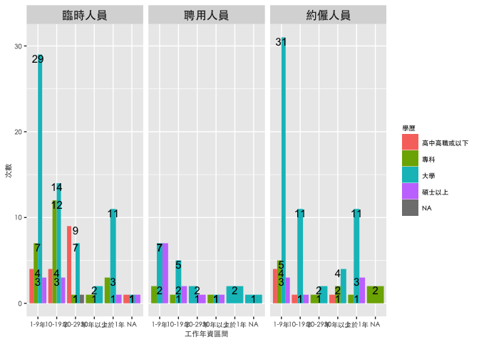

不同契約人力工作性質與薪資待遇之差異
================
Jerry Yang，楊宗政

``` r
knitr::opts_chunk$set(echo = TRUE)
options(htmltools.dir.version = FALSE)
sjPlot::set_theme(theme.font="PingFang TC") #解決底下有框框問題
library(ggplot2)
library(sjlabelled)
library(sjmisc)
library(sjPlot)
library(GGally)
```

# 先讀入契約人力問卷調查資料

檔案形式為sav檔，會先用sav檔讀入，在儲存成rda檔做分析

## 讀入sav檔並儲存成rda檔

問卷資料用contract\_staff來存放

``` r
contract_staff <- read_spss("~/Documents/2021TextbookProject/契約人力問卷調查.sav")

#將sav檔儲存成rda檔
save(contract_staff, file = "~/Documents/2021TextbookProject/契約人力問卷調查.rda",compress = T)

rm(list=ls())
```

## 讀入rda檔

檢查contract\_staff的屬性

``` r
load("契約人力問卷調查.rda")
nrow(contract_staff)
```

    ## [1] 231

``` r
names(contract_staff)
```

    ##  [1] "ID"                   "A01"                  "A02"                 
    ##  [4] "A03"                  "A04"                  "A05"                 
    ##  [7] "A06"                  "A07"                  "A08"                 
    ## [10] "A09"                  "B10"                  "B11"                 
    ## [13] "B12"                  "B13"                  "B14"                 
    ## [16] "B15"                  "B16"                  "B17"                 
    ## [19] "B18"                  "B19"                  "C20"                 
    ## [22] "C21"                  "C22"                  "C23"                 
    ## [25] "C24"                  "C25"                  "C26"                 
    ## [28] "C27"                  "C28"                  "C29"                 
    ## [31] "C30"                  "C31"                  "C32"                 
    ## [34] "D33"                  "D34"                  "D35_1"               
    ## [37] "D35_2"                "D35_3"                "D35_4"               
    ## [40] "D35_5"                "D35_6"                "D35_7"               
    ## [43] "D35_8"                "D35_9"                "D35_10"              
    ## [46] "D35_11"               "E36"                  "E37"                 
    ## [49] "E38"                  "E39"                  "E40"                 
    ## [52] "E41"                  "E42"                  "E43"                 
    ## [55] "E44"                  "E45"                  "E46"                 
    ## [58] "E47"                  "E48"                  "E49"                 
    ## [61] "E50"                  "E51"                  "E52"                 
    ## [64] "E53"                  "F01"                  "F02"                 
    ## [67] "F03"                  "F04"                  "F05"                 
    ## [70] "F06"                  "F07"                  "F08"                 
    ## [73] "G01"                  "薪資福利心理契約違反" "工作負荷心理契約違反"
    ## [76] "工作滿意度"           "組織承諾"             "年齡"                
    ## [79] "H1"                   "H2"                   "H3"                  
    ## [82] "情感性承諾"           "持續性承諾"           "規範性承諾"          
    ## [85] "filter_$"             "G02"                  "G05"                 
    ## [88] "G06"                  "G07"                  "W4"                  
    ## [91] "education"            "D1"                   "D2"                  
    ## [94] "D3"                   "D4"                   "male"                
    ## [97] "marry"

``` r
class(contract_staff)
```

    ## [1] "data.frame"

## 將變數名稱修改,並重新命名變數

``` r
#重新命名變數
contract_staff$G01[contract_staff$G01 == 1] <- "聘用人員"
contract_staff$G01[contract_staff$G01 == 2] <- "約僱人員"
contract_staff$G01[contract_staff$G01 == 3] <- "臨時人員"

contract_staff$W4[contract_staff$W4 == 1] <- "行政庶務"
contract_staff$W4[contract_staff$W4 == 2] <- "專業研究性"
contract_staff$W4[contract_staff$W4 == 3] <- "技術性"
contract_staff$W4[contract_staff$W4 == 4] <- "民眾服務"

contract_staff$H3[contract_staff$H3 == 1] <- "2萬-3萬"
contract_staff$H3[contract_staff$H3 == 2] <- "3萬-4萬"
contract_staff$H3[contract_staff$H3 == 3] <- "4萬-5萬"
contract_staff$H3[contract_staff$H3 == 4] <- "5萬-6萬"
contract_staff$H3[contract_staff$H3 == 5] <- "6萬以上"

contract_staff$education[contract_staff$education == 1] <- "高中高職或以下"
contract_staff$education[contract_staff$education == 2] <- "專科"
contract_staff$education[contract_staff$education == 3] <- "大學"
contract_staff$education[contract_staff$education == 4] <- "碩士以上"

contract_staff$H2[contract_staff$H2 == 1] <- "少於1年"
contract_staff$H2[contract_staff$H2 == 2] <- "1-9年"
contract_staff$H2[contract_staff$H2 == 3] <- "10-19年"
contract_staff$H2[contract_staff$H2 == 4] <- "20-29年"
contract_staff$H2[contract_staff$H2 == 5] <- "30年以上"

#查找變數在第幾列
which(colnames(contract_staff) == "G01")
```

    ## [1] 73

``` r
which(colnames(contract_staff) == "W4")
```

    ## [1] 90

``` r
which(colnames(contract_staff) == "F06")
```

    ## [1] 70

``` r
which(colnames(contract_staff) == "H3")
```

    ## [1] 81

``` r
which(colnames(contract_staff) == "education")
```

    ## [1] 91

``` r
which(colnames(contract_staff) == "F04")
```

    ## [1] 68

``` r
which(colnames(contract_staff) == "F05")
```

    ## [1] 69

``` r
which(colnames(contract_staff) == "H2")
```

    ## [1] 80

``` r
#重新命名變數名稱
names(contract_staff)[73] <- "契約人力"
names(contract_staff)[90] <- "工作性質"
names(contract_staff)[70] <- "薪資待遇"
names(contract_staff)[81] <- "月薪資區間"
names(contract_staff)[91] <- "學歷"
names(contract_staff)[68] <- "學歷程度"
names(contract_staff)[69] <- "現職機關工作年資"
names(contract_staff)[80] <- "工作年資區間"
```

``` r
contract_staff$學歷 <- factor(contract_staff$學歷, c("高中高職或以下", "專科", "大學", "碩士以上"))#由於長條圖不會自己排序資料，因此轉換成factor格式，再根據自己定義的順序排序。
ggplot(contract_staff, aes(x = 工作年資區間, fill = 學歷)) + 
  geom_bar(position = "dodge") + facet_wrap(~契約人力)+ theme(strip.text.x = element_text(size = 12)) + labs(y = "次數", size = 10) + geom_text(stat = "count", aes(label = ( ..count..)), vjust = 1, color = I("black"), size = 4) + theme(text = element_text(family = "黑體-繁 中黑", size = 7))
```



``` r
ggplot(contract_staff, aes(x = 現職機關工作年資, y = 薪資待遇, colour = 契約人力))+
  geom_point()+geom_smooth()
```


``` r
ggplot(contract_staff, aes(x = 年齡, y = 薪資待遇, colour = 契約人力))+
  geom_point()+geom_smooth()
```


``` r
ggplot(data = contract_staff, aes(x = 月薪資區間, y = 工作性質, 
                      color = 契約人力, shape = 契約人力)) + 
  geom_jitter(alpha = 1/2, size = 3.5) + 
  geom_smooth(method = "lm", se = FALSE)
```


``` r
constract.df = contract_staff[, c("薪資待遇", "學歷程度", "現職機關工作年資", "年齡")]
cor.mat = cor(constract.df, use = "complete", method = "pearson")
round(cor.mat, 4)
```

    ##                  薪資待遇 學歷程度 現職機關工作年資    年齡
    ## 薪資待遇           1.0000   0.3839          -0.0803  0.0136
    ## 學歷程度           0.3839   1.0000          -0.2219 -0.1962
    ## 現職機關工作年資  -0.0803  -0.2219           1.0000  0.8251
    ## 年齡               0.0136  -0.1962           0.8251  1.0000

``` r
pairs(constract.df, main = "中文標題", family = "黑體-繁 中黑") + theme(plot.title = element_text(size = 20, color = "red", hjust = 0.5, family = "PingFang TC"), legend.position = "right")
```


    ## NULL

``` r
GGally::ggpairs(data = constract.df)
```


``` r
GGally::ggcorr(data = constract.df, 
               method = c("complete", "pearson"))
```


``` r
my_fn <- function(data, mapping, ...){
  p <- ggplot(data = data, mapping = mapping) + 
    geom_point() +
    geom_smooth(method = lm, se = FALSE, fill = "blue", color = "blue", ...)
  p
}
GGally::ggpairs(data = constract.df, 
        lower = list(continuous = my_fn)) + theme(text = element_text(family = "黑體-繁 中黑", size = 10))
```


``` r
contract_staff$學歷 <- factor(contract_staff$學歷, c("高中高職或以下", "專科", "大學", "碩士以上"))
ggplot(data = contract_staff, aes(x = 月薪資區間, y =  學歷)) + labs(x = "月薪資", y = "學歷", title = "月薪資與學歷之差異") + geom_jitter() + facet_grid(工作性質 ~ 契約人力) + theme(strip.text.x = element_text(size = 12) ) +  theme(strip.text.y = element_text(size = 10) ) + theme(plot.title = element_text(size = 10, face = "bold", color = "black"), axis.title = element_text(size = 12)) + theme(text = element_text(family = "黑體-繁 中黑", size = 9))
```


