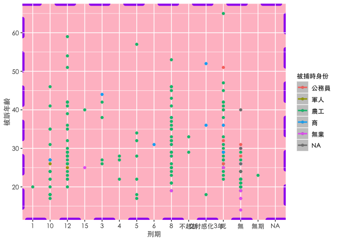
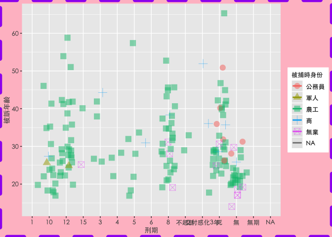

鹿窟事件身份年齡與其刑期之關係
================
Jerry Yang，楊宗政

``` r
knitr::opts_chunk$set(echo = TRUE)
options(htmltools.dir.version = FALSE)
library(sjlabelled)
library(sjmisc)
library(sjPlot)
library(readxl)
library(ggplot2)
sjPlot::set_theme(theme.font="PingFang TC") #解決底下有框框問題
luku_df<- read_excel("~/Documents/2021TextbookProject/luku.xlsx")
```

# 先讀入鹿窟事件調查資料

檔案形式為excel檔

## 讀入excel檔

問卷資料用luku\_df來存放

``` r
nrow(luku_df)
```

    ## [1] 187

``` r
names(luku_df)
```

    ##  [1] "姓名"                    "被捕時身份"             
    ##  [3] "被訴年齡"                "起訴日期"               
    ##  [5] "刑度/刑期"               "刑度變更"               
    ##  [7] "終審裁判罪名/判決書字號" "終審日期"               
    ##  [9] "補償基金會案號/決定書"   "補償金額(萬)"           
    ## [11] "轉型正義情形"            "備註"                   
    ## [13] "羅織身份"

``` r
class(luku_df)
```

    ## [1] "tbl_df"     "tbl"        "data.frame"

``` r
which(colnames(luku_df) == "刑度/刑期")
```

    ## [1] 5

``` r
names(luku_df)[5] <- "刑期"
class(luku_df$被捕時身份)
```

    ## [1] "character"

## 將變數名稱修改,並重新命名變數

``` r
luku_df$被捕時身份[luku_df$被捕時身份 == "印刷工"] <- "農工"

luku_df$被捕時身份[luku_df$被捕時身份 == "工"] <- "農工"
luku_df$被捕時身份[luku_df$被捕時身份 == "礦工"] <- "農工"
luku_df$被捕時身份[luku_df$被捕時身份 == "礦工、農、木工"] <- "農工"
luku_df$被捕時身份[luku_df$被捕時身份 == "礦工、農"] <- "農工"


luku_df$被捕時身份[luku_df$被捕時身份 == "商"] <- "商"
luku_df$被捕時身份[luku_df$被捕時身份 == "會計"] <- "商"


luku_df$被捕時身份[luku_df$被捕時身份 == "技工"] <- "公務員"
luku_df$被捕時身份[luku_df$被捕時身份 == "公務人員"] <- "公務員"

luku_df$被捕時身份[luku_df$被捕時身份 == "家務"] <- "無業"
luku_df$被捕時身份[luku_df$被捕時身份 == "兒童"] <- "無業"
luku_df$被捕時身份[luku_df$被捕時身份 == "學生"] <- "無業"
luku_df$被捕時身份[luku_df$被捕時身份 == "無"] <- "無業"

luku_df$被捕時身份[luku_df$被捕時身份 == "農"] <- "農工"


luku_df$刑期[luku_df$刑期 == "自首"] <- "無"
luku_df$刑期[luku_df$刑期 == "感訓"] <- "無"
luku_df$刑期[luku_df$刑期 == "自新"] <- "無"
luku_df$刑期[luku_df$刑期 == "逮捕時當場擊斃(民國42年1月12日)"] <- "無"
luku_df$刑期[luku_df$刑期 == "死(逮捕時困斃)"] <- "無"
luku_df$刑期[luku_df$刑期 == "在山上被蛇咬死"] <- "無"

luku_df$刑期[luku_df$刑期 == "交付感化3年（未滿14歲）"] <- "交付感化3年"
```

``` r
ggplot(luku_df, aes(x = 刑期, y = 被訴年齡, colour = 被捕時身份))+
  geom_point()+geom_smooth() + theme(panel.background = element_rect(colour = "purple", fill = "pink", size = 3, linetype = "dashed"))+ theme(text = element_text(family = "黑體-繁 中黑", size = 9.5))
```



``` r
ggplot(data = luku_df, aes(x = 刑期, y = 被訴年齡, 
                      color = 被捕時身份, shape = 被捕時身份)) + 
  geom_jitter(alpha = 1/2, size = 4) + geom_smooth(method = "lm", se = FALSE) + theme(plot.background = element_rect(colour = "purple", fill = "pink", size = 3, linetype = "dashed"))+ theme(text = element_text(family = "黑體-繁 中黑", size = 9.5))
```


